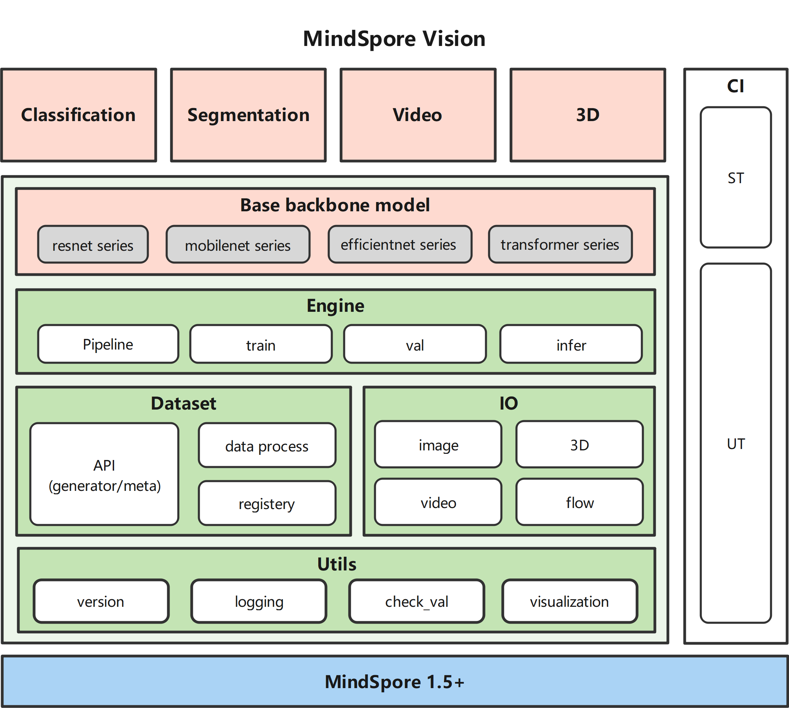

# MindSpore Vision


MindSpore Vision is an open source computer vision research toolbox based on MindSpore.

## Projects in MindSpore Vision

- [Classification](mindvision/classification/README_en.md): Image classification toolbox and benchmark.

> The master branch works with **MindSpore 1.5+**.

## Base Structure

MindSpore Vision a MindSpore base Python package that provides high-level features:

- Base backbone of models like resnet and mobilenet series.
- Deep neural networks work flows built on a engin system.
- Domain oriented rich dataset interface.
- Rich visualization and IO(Input/Output) interfaces.



## Installation

Please refer to [get_started.md]() for installation.

## License

This project is released under the [Apache 2.0 license](LICENSE).

## Feedbacks and Contact

The dynamic version is still under development, if you find any issue or have an idea on new features, please don't hesitate to contact us via [Gitee Issues](https://gitee.com/mindspore/vision/issues).

## Acknowledgement

MindSpore is an open source project that welcome any contribution and feedback. We wish that the toolbox and benchmark could serve the growing research
community by providing a flexible as well as standardized toolkit to reimplement existing methods
and develop their own new computer vision methods.

## Contributing

We appreciate all contributions to improve MindSpore Vision. Please refer to [CONTRIBUTING.md](CONTRIBUTING.md) for the contributing guideline.

## Citation

If you find this project useful in your research, please consider citing:

```latex
@misc{MindSpore Vision 2021,
    title={{MindSpore Vision}:MindSpore Vision Toolbox and Benchmark},
    author={MindSpore Vision Contributors},
    howpublished = {\url{https://gitee.com/mindspore/vision}},
    year={2021}
}
```