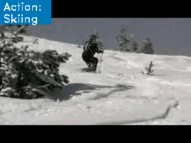
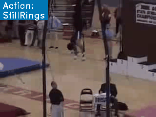

# ARN


# Description

ARN builds on a C3D encoder for spatio-temporal video blocks to capture short-range action patterns. To improve training of the encoder,they introduce spatial and temporal self-supervision by rotations, and spatial and temporal jigsaws and propose "attention by alignment", a new data splits for a systematic comparison of few-shot action recognition algorithms.

# Model Architecture


The overall network architecture of ARN is shown below:

[\[2001.03905\] Few-shot Action Recognition with Permutation-invariant Attention (arxiv.org)](https://arxiv.org/abs/2001.03905)

# Dataset

Dataset used: [UCF101](https://www.crcv.ucf.edu/data/UCF101.php)

- Description: UCF101 is an action recognition data set of realistic action videos, collected from YouTube, having 101 action categories. This data set is an extension of UCF50 data set which has 50 action categories.

- Dataset size：13320 videos
    - Note：Use the official Train/Test Splits([UCF101TrainTestSplits](https://www.crcv.ucf.edu/data/UCF101/UCF101TrainTestSplits-RecognitionTask.zip)).
- Data format：rar
    - Note：Data will be processed in dataset_preprocess.py
- Data Content Structure

```text
.
└─ucf101                                    // contains 101 file folder
  ├── ApplyEyeMakeup                        // contains 145 videos
  │   ├── v_ApplyEyeMakeup_g01_c01.avi      // video file
  │   ├── v_ApplyEyeMakeup_g01_c02.avi      // video file
  │    ...
  ├── ApplyLipstick                         // contains 114 image files
  │   ├── v_ApplyLipstick_g01_c01.avi       // video file
  │   ├── v_ApplyLipstick_g01_c02.avi       // video file
  │    ...
  ├── ucfTrainTestlist                      // contains category files
  │   ├── classInd.txt                      // Category file.
  │   ├── testlist01.txt                    // split file
  │   ├── trainlist01.txt                   // split file
  ...
```

# Quick Start

## Requirements Installation

```text
pip install -r requirements.txt
```

## Running

```bash
cd tools/classification

# run the following command for trainning
python train.py -c ../../mindvideo/config/arn/arn.yaml

# run the following command for evaluation
python eval.py -c ../../mindvideo/config/arn/arn.yaml

# [Model Description](https://github.com/ZJUT-ERCISS/arn_mindspore#contents)

## [Performance](https://github.com/ZJUT-ERCISS/arn_mindspore#contents)


#### Benchmark

>  on ucf101 under 5-way 1-shot setting

|          | MindSpore | third party re-produce |
| -------- | --------- | ----- |
| Accuracy | 56.4%       | 42.39%   |

Note that although our result on ucf101 under 5-way 1-shot setting is lower than the result mentioned in the original paper which is 62.1 ± 1.0, our experiment on their source code based on PyTorch shows that the accuracy can only reach to 42.39%.

#### Visualization

Examples given below are the predictions this arn model makes under the settings of 5-way 1-shot and one query video each class.







# Citation

If you find this project useful in your research, please consider citing:

```text
@article{DBLP:journals/corr/abs-2001-03905,
  author    = {Hongguang Zhang and
               Li Zhang and
               Xiaojuan Qi and
               Hongdong Li and
               Philip H. S. Torr and
               Piotr Koniusz},
  title     = {Few-shot Action Recognition via Improved Attention with Self-supervision},
  journal   = {CoRR},
  volume    = {abs/2001.03905},
  year      = {2020}
}
```


```latex
@misc{arn_mindspore,
    author = {Zhang, Hongguang and Zhang, Li and Qi, Xiaojuan and Li, Hongdong and Torr, Philip HS
                and Koniusz, Piotr},
    title = {MindVideo Models},
    year = {2022},
    publisher = {GitHub},
    journal = {GitHub repository},
    doi = {10.1007/978-3-030-58558-7_31},
    howpublished = {\url{https://github.com/ZJUT-ERCISS/zjut_mindvideo}}
}
```